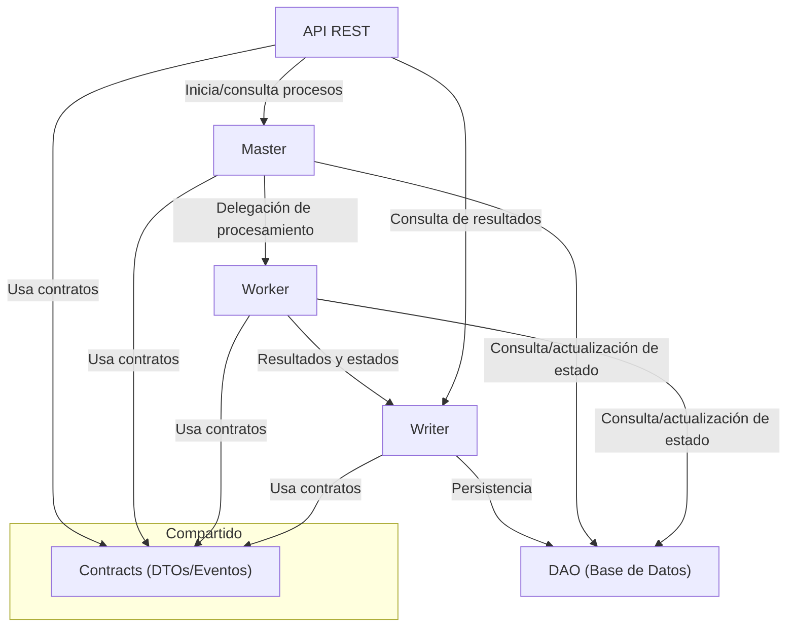
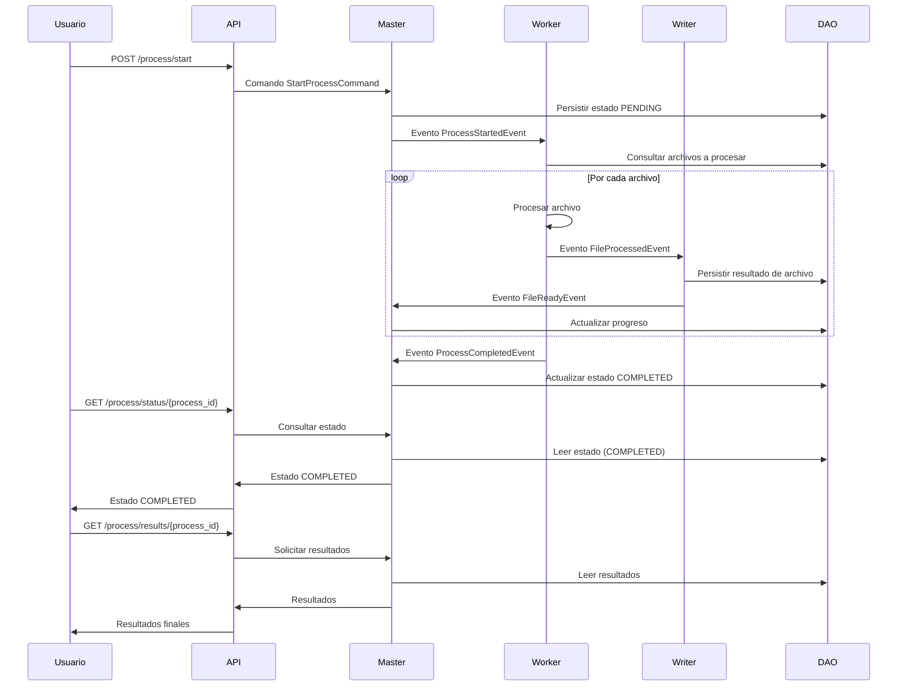

# Arquitectura del Sistema de Procesamiento de Documentos

## Descripción General

El sistema está diseñado bajo una arquitectura modular y escalable, separando claramente las responsabilidades en diferentes capas y servicios. Utiliza procesamiento asíncrono y persistencia de estados para garantizar resiliencia y escalabilidad.

## Componentes Principales

- **API REST (DocumentProcessor.API):** Expone los endpoints para controlar y monitorear los procesos.
- **Master (DocumentProcessor.Master):** Orquesta y gestiona el ciclo de vida de los procesos.
- **Worker (DocumentProcessor.Worker):** Realiza el procesamiento real de los archivos en segundo plano.
- **Writer (DocumentProcessor.Writer):** Se encarga de la persistencia de resultados y logs.
- **DAO (DocumentProcessor.Dao):** Acceso y gestión de la base de datos.
- **Contracts:** Define los contratos, DTOs y eventos compartidos entre los servicios.

## Diagrama de Arquitectura

## Explicación del Flujo

1. El usuario interactúa con la **API REST** para iniciar o consultar procesos.
2. La **API** comunica las solicitudes al **Master**, que orquesta el ciclo de vida del proceso.
3. El **Master** delega el procesamiento de archivos a los **Workers**.
4. Los **Workers** procesan los archivos y envían los resultados al **Writer**.
5. El **Writer** persiste los resultados y estados en la base de datos a través del **DAO**.
6. Todos los servicios utilizan contratos y eventos definidos en el módulo **Contracts** para garantizar la interoperabilidad.

## Consideraciones de Diseño

- Separación de responsabilidades para facilitar el mantenimiento y la escalabilidad.
- Procesamiento asíncrono y manejo robusto de errores.
- Persistencia de estados para resiliencia ante fallos.
- Facilidad para escalar horizontalmente los componentes Worker y Writer. 

## Diagrama de Secuencia del Proceso Completo

A continuación se muestra un diagrama de secuencia que ilustra el flujo de procesamiento de un documento, desde que la API recibe la solicitud hasta que el proceso finaliza, utilizando comandos y eventos:

### Explicación del Diagrama

1. El usuario inicia el proceso mediante la API.
2. La API envía un comando al Master para iniciar el proceso.
3. El Master persiste el estado inicial y emite un evento para que el Worker comience el procesamiento.
4. El Worker procesa cada archivo, emitiendo eventos y resultados que el Writer persiste.
5. El Master actualiza el progreso y, al finalizar, marca el proceso como COMPLETED.
6. **Dado que el procesamiento es asíncrono, el usuario debe consultar periódicamente la API (por ejemplo, usando `GET /process/status/{process_id}`) para saber si el proceso ha finalizado y obtener los resultados.** 